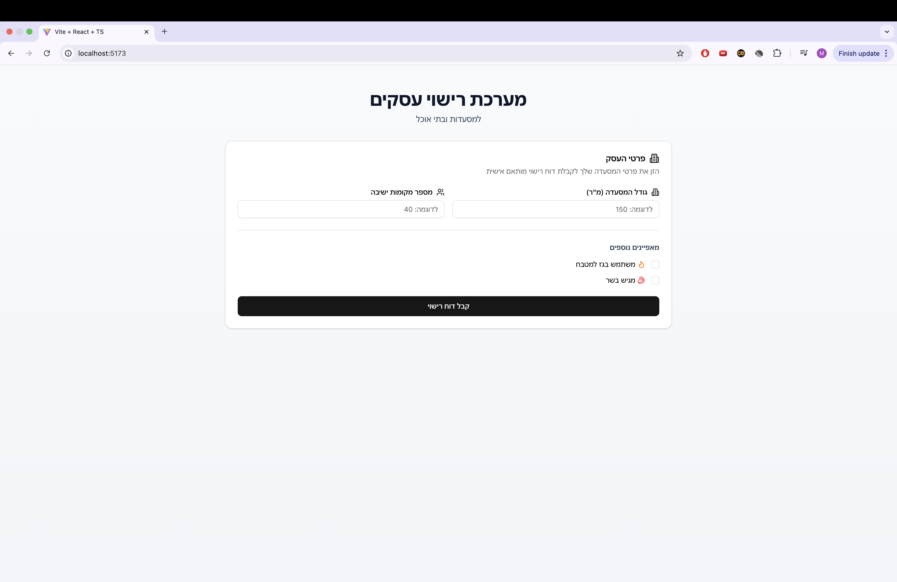
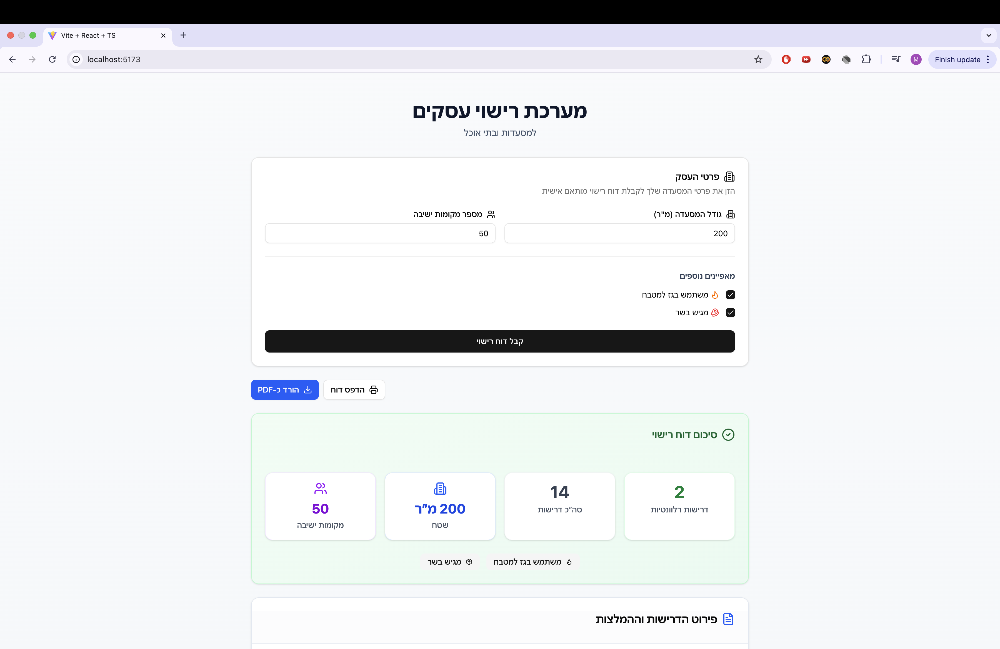
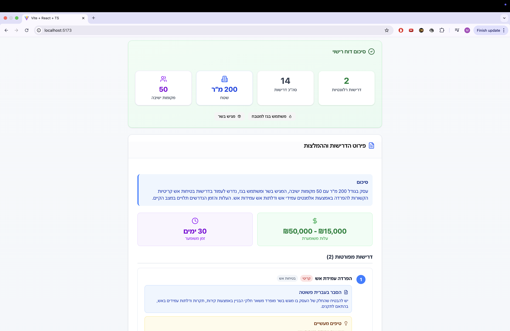
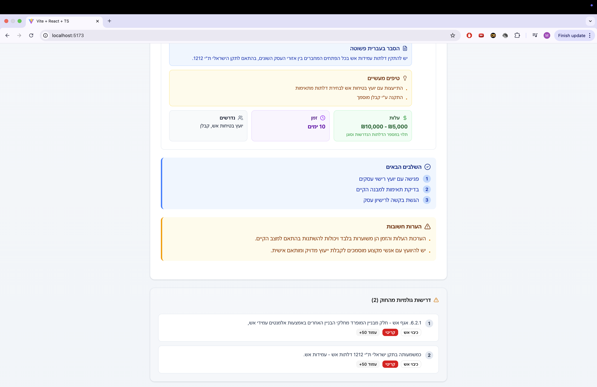

# מערכת רישוי עסקים למסעדות 🍽️

## תיאור הפרויקט

מערכת אינטראקטיבית המסייעת לבעלי מסעדות בישראל להבין את דרישות הרישוי הרלוונטיות לעסק שלהם. המערכת מעבדת נתוני רגולציה גולמיים מקובצי PDF ממשלתיים, מסננת אותם בהתאם למאפייני העסק הספציפיים, ומייצרת דוח מותאם אישית בעברית פשוטה באמצעות בינה מלאכותית.

## 🎯 מטרות הפרויקט

- פישוט השפה המשפטית של דרישות הרישוי
- חיסכון בזמן ובעלויות יעוץ לבעלי עסקים
- הנגשת מידע רגולטורי בצורה ברורה ומעשית
- יצירת תוכנית פעולה מסודרת לקבלת רישיון עסק

## 🚀 הרצה מהירה

### דרישות מערכת

- Python 3.8+
- Node.js 16+
- חיבור אינטרנט (לשימוש ב-Gemini API)

### התקנת Backend

```bash
cd backend
python -m venv venv
source venv/bin/activate  # Windows: venv\Scripts\activate
pip install -r requirements.txt
```

# יצירת קובץ .env ב-backend

echo "GEMINI_API_KEY=your-api-key-here" > backend/.env

cd backend
python app.py

# Server runs on http://localhost:5001

cd frontend
npm install

cd frontend
npm run dev

# App opens on http://localhost:5173

📸 צילומי מסך

1. טופס הזנת נתונים ריק



2. טופס מלא עם תוצאות



3. דוח מפורט
   
   

## 🏗️ ארכיטקטורת המערכת

### תרשים זרימה
```
                    📋 USER INPUT
                         │
                         ▼
        ┌─────────────────────────────────┐
        │    🖥️  React Frontend          │
        │    • TypeScript + Tailwind      │
        │    • Port 5173                  │
        │    • Business Form              │
        └─────────────────────────────────┘
                         │ HTTP POST
                         ▼
        ┌─────────────────────────────────┐
        │    🔧  Flask Backend            │
        │    • Python + Flask             │
        │    • Port 5001                  │
        │    • 3 API Endpoints            │
        └─────────────────────────────────┘
                    │         │
          ┌─────────┘         └─────────┐
          ▼                             ▼
    ┌──────────┐                ┌──────────────┐
    │ 📄 PDF   │                │ 🤖 Gemini   │
    │ Regs     │                │ AI API       │
    │ (JSON)   │                │ (Google)     │
    └──────────┘                └──────────────┘
```

### תהליך עבודה
1. **🎯 הזנת נתונים** - משתמש מזין פרטי עסק (גודל, מקומות, גז, בשר)
2. **🔍 סינון דרישות** - Backend מסנן 14 תקנות לפי מאפייני העסק
3. **🤖 עיבוד AI** - Gemini מתרגם טקסט משפטי לעברית פשוטה
4. **📋 דוח מותאם** - החזרת דוח עם עלויות, זמנים וטיפים מעשיים

## 📁 מבנה הפרויקט

```
restaurant-licensing/
├── backend/
│   ├── app.py                    # Flask server - נקודת כניסה ראשית
│   ├── requirements.txt          # Python dependencies
│   ├── services/
│   │   ├── pdf_extractor.py      # חילוץ נתונים מ-PDF
│   │   ├── regulation_filter.py  # לוגיקת סינון דרישות
│   │   └── ai_service.py         # אינטגרציה עם Gemini AI
│   └── data/
│       ├── restaurant_regulations.pdf  # קובץ מקור
│       └── extracted_regulations.json  # נתונים מעובדים
│
├── frontend/
│   ├── src/
│   │   ├── App.tsx               # קומפוננטה ראשית
│   │   ├── components/
│   │   │   └── ReportDisplay.tsx # תצוגת דוח
│   │   ├── types/
│   │   │   └── index.ts          # TypeScript interfaces
│   │   └── lib/
│   │       └── utils.ts          # Utility functions
│   ├── package.json
│   └── tailwind.config.js       # Tailwind CSS configuration
│
└── docs/
    └── images/                   # צילומי מסך
```

📚 תיעוד API
Endpoints
GET /api/health
בדיקת סטטוס השרת
jsonResponse: {
"status": "alive",
"regulations_loaded": 14
}
POST /api/report
יצירת דוח רישוי מותאם אישית
jsonRequest: {
"size": 150, // גודל במ״ר
"seats": 40, // מספר מקומות ישיבה
"usesGas": true, // שימוש בגז
"servesMeat": false // הגשת בשר
}

Response: {
"user_input": {...},
"total_regulations": 14,
"relevant_regulations": 2,
"report": "דוח מפורט בעברית...",
"raw_regulations": [...]
}
GET /api/regulations
קבלת כל הדרישות (לצורכי בדיקה)
🔧 טכנולוגיות
Backend

Flask - Web framework
PyPDF2 - עיבוד קבצי PDF
Google Generative AI - Gemini API client
python-dotenv - ניהול משתני סביבה

Frontend

React 18 - UI Framework
TypeScript - Type safety
Tailwind CSS - Styling
Shadcn/ui - Component library
Axios - HTTP client
Lucide React - Icons
React-to-print - PDF export

🤖 שימוש בכלי AI

1. מודל AI ראשי - Google Gemini 1.5 Flash
   למה נבחר:

תמיכה מעולה בעברית
API חינמי למפתחים (60 קריאות/דקה)
מהירות תגובה גבוהה
יכולת הבנת הקשר ארוך

Prompt עיקרי ליצירת דוח:
pythonprompt = f"""
אתה יועץ רישוי עסקים מקצועי בישראל.

פרטי העסק:

- גודל: {size} מ"ר
- מקומות ישיבה: {seats}
- משתמש בגז: {usesGas}
- מגיש בשר: {servesMeat}

הדרישות הרלוונטיות מהחוק:
{regulations}

המשימה שלך:

1. תרגם את הדרישות לעברית פשוטה וברורה
2. סדר לפי חשיבות (קריטי / חשוב / רצוי)
3. הוסף טיפים מעשיים לכל דרישה
4. הערך עלויות וזמנים משוערים
5. השתמש בטון מעודד וידידותי

צור דוח מסודר ונעים לקריאה בעברית.
""" 2. כלי AI לפיתוח
GitHub Copilot

שימוש: השלמת קוד אוטומטית
דוגמה: יצירת פונקציות סינון, כתיבת regex patterns

Claude (Anthropic)

שימוש: תכנון ארכיטקטורה, פתרון בעיות
דוגמה: עיצוב מבנה הנתונים, אופטימיזציה של קוד

ChatGPT

שימוש: דיבאג, הסברים טכניים
דוגמה: פתרון בעיות עם Hebrew text encoding

📊 מבנה הנתונים
Regulation Object
typescriptinterface Regulation {
id: number;
category: "health" | "fire_safety" | "general";
hebrew_text: string;
source_page: string;
priority: "critical" | "high" | "medium";
}
Business Input
typescriptinterface BusinessInput {
size: number; // Square meters
seats: number; // Seating capacity
usesGas: boolean; // Gas usage
servesMeat: boolean; // Meat serving
}
🔍 אלגוריתם סינון דרישות
pythondef filter_regulations(regulations, user_input):
filtered = []

    for reg in regulations:
        # תמיד כלול דרישות קריטיות
        if reg['priority'] == 'critical':
            filtered.append(reg)

        # סינון לפי גז
        if user_input['usesGas'] and 'גז' in reg['hebrew_text']:
            filtered.append(reg)

        # סינון לפי גודל
        if user_input['size'] > 100 and 'מטר' in reg['hebrew_text']:
            filtered.append(reg)

    return remove_duplicates(filtered)

📖 יומן פיתוח ואתגרים
אתגר 1: עיבוד PDF בעברית
בעיה: PyPDF2 התקשה לחלץ טקסט עברי מה-PDF הממשלתי
פתרון: שימוש ב-regex patterns ספציפיים וניקוי ידני של חלק מהנתונים
אתגר 2: פורט 5000 תפוס
בעיה: AirPlay Receiver ב-Mac תופס את פורט 5000
פתרון: החלפה לפורט 5001
אתגר 3: עיצוב דוח ב-Hebrew RTL
בעיה: כיוון טקסט ואייקונים לא נכון
פתרון: שימוש ב-dir="rtl" ו-Tailwind utilities מתאימים
אתגר 4: עלויות API
בעיה: חשש מעלויות OpenAI
פתרון: מעבר ל-Google Gemini עם tier חינמי
🚀 שיפורים עתידיים
תכונות נוספות

תמיכה בסוגי עסקים נוספים (קפה, בר, מאפייה)
מערכת משתמשים ושמירת היסטוריית דוחות
אינטגרציה ישירה עם מערכות ממשלתיות
תזכורות אוטומטיות לחידוש רישיונות
מעקב אחר התקדמות בתהליך הרישוי

שיפורים טכניים

Caching של דוחות נפוצים
WebSocket לעדכונים בזמן אמת
Docker containerization
Unit tests מקיפים
CI/CD pipeline

💡 לקחים והתובנות

חשיבות ה-Prompt Engineering - ניסוח נכון של ה-prompt משפיע דרמטית על איכות הדוח
UI/UX בעברית - דורש תשומת לב מיוחדת ל-RTL ופונטים
עבודה עם PDFs ממשלתיים - מאתגר טכנית, כדאי לשקול OCR
ערך של Structured Data - מעבר ל-JSON מ-free text שיפר את האמינות
Free Tier APIs - Gemini הוכיח את עצמו כפתרון מעולה ללא עלות
